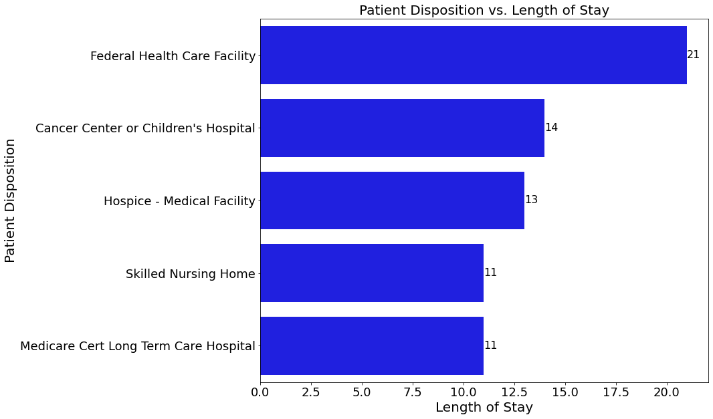
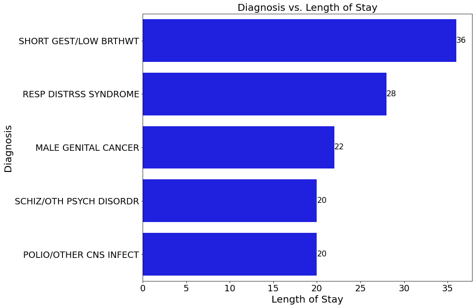
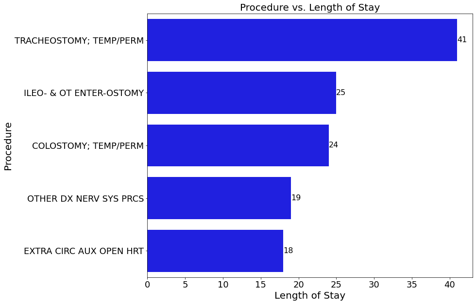

# Hospital Length of Stay Model Analysis

**Author**: [Jack Locke](mailto:jackdlocke@gmail.com)

# Overview
1. Business Understanding
    * a. Domain Knowledge
2. Data Understanding
3. Data Preparation
    * a. Dropping Unnecessary Columns
    * b. Handle Missing/Null Values
    * c. Handle Placeholder Values/Column Manipulation
    * d. Primary Column Information
4. Exploratory Data Analysis
    * a. Patient Disposition vs. Length of Stay
    * b. Diagnosis vs. Length of Stay
    * c. Procedure vs. Length of Stay
5. Modeling
    * a. Train/Validation/Test Splits
    * b. Evaluation Metrics
    * c. Categorical/Numerical Columns
    * d. Baseline Linear Regression (No PCA)
    * e. Three Regression Models
            * Linear Regression (with PCA)
            * Decision Tree Regression
            * LinearSVR
    * f. Tuning LinearSVR with Gridsearch
6. Evaluation
    * a. Final Model
7. Conclusions
    * a. Limitations
    * b. Recommendations/Next Steps


# Business Understanding
The business stakeholder is a healthcare hospital chain that wants to predict the length of stay for patients to improve resource allocation and patient care. My project analyzes patients' lengths of stay based on patient discharge data. The discharge data contains patient information such as diagnosis, disposition, procedures, etc. The model aims to predict the length of stay based on these features. While doing so, the model will find patterns and trends in the data that will help the business better understand what leads to longer/shorter lengths of stay. The additional information will lead to improved resource allocation and patient care, leading to more business growth. My analysis will use the CRISP-DM (Cross-industry standard process for data mining) methodology.
### Domain Knowledge
I performed additional research on determining the length of stay for patients to give myself more domain knowledge. I found a research paper on the topic, conducted by “A descriptive, retrospective study was designed at Zeinabiyeh hospital, affiliated with Shiraz University of Medical Sciences, Shiraz, Iran, between March 2019 and March 2020.” They were working with demographics different from mine and mainly focused on decision trees, so the details of the results differed from my modeling. But, it was informative in regards to helping me during my EDA. Similar results included, “We observed that patients with more severe diseases hospitalized in critical care wards had a longer LOS than those not admitted to critical care wards. The older patient had longer hospital LOS than the younger.” In my EDA, you will see that when I explore disposition, patients with more serious conditions and greater age demonstrated longer stays on average. This can be seen with cancer care facilities (severe disease) and hospice facilities (age). However, they also partially focused on gender when making a prediction, and my results did not find gender to be a big factor in my modeling. Overall, it helped increase my understanding of the topic.

Citation/Data: https://bmcmedinformdecismak.biomedcentral.com/articles/10.1186/s12911-022-02027-w

# Data Understanding
I am working with a dataset released by New York State in regard to inpatient discharge. The dataset I used for the model analysis will focus on King County (Brooklyn) hospitals. “The Statewide Planning and Research Cooperative System (SPARCS) Inpatient De-identified dataset is a wealth of information, containing discharge level detail on various aspects of hospital inpatient discharges in New York State during the year 2010. From patient characteristics such as age group, gender, race and ethnicity to diagnoses, treatments, services and charges - all data elements excluding those considered identifiable have been made available within this dataset. This data does not contain any protected health information (PHI) under the Health Insurance Portability and Accountability Act (HIPAA).” The dataset contains roughly 300,000 rows and 38 columns. Below is a link to the dataset and information on each feature.


Citation/Data: https://www.kaggle.com/datasets/thedevastator/2010-new-york-state-hospital-inpatient-discharge

# Data Preparation
First, I dropped all unnecessary columns. These were columns that held no value to the model. I dropped columns that were missing most of their data, were unique identifiers, or only had one unique value. After doing that, I removed all rows containing missing data because it was a small amount, and afterward, I still had roughly 300,000 rows, which was sufficient for my model analysis. Additionally, I handled placeholder values. I also performed a simple linear regression in Statsmodels and looked at each feature's p-values. I dropped columns whose p-values were not statistically significant. After that, I looked at the three columns that had the most significant impact on my model based on their coefficients from the simple linear regression. 

* A. Dropping Unnecessary Columns
* B. Handle Missing/Null Values
* C. Handle Placeholder Values/Column Manipulation
* D. Primary Columns Information


# Exploratory Data Analysis
As mentioned, my EDA will focus on the three most significant coefficient estimates, which had some of the largest impacts on my model. I will explore their relationships to our target variable, the length of stay. This will help me understand patterns and trends within our dataset.

### Patient Disposition vs. Length of Stay

### Diagnosis vs. Length of Stay

### Procedure vs. Length of Stay


# Model
In the modeling section of my notebook, I am trying to predict the length of stay for patients. I will be performing regression models to do so. The goal of our models is to make sure it runs the same on both the training data as it does on unseen data, which means the model is generalizable. The general idea is first to find the model with the best fit; from there, I will assess the model's r2 scores. If models have the exact fit and R2 score, I will use RMSE as a tiebreaker to determine the best-performing model.

The first thing I did was perform a train/valid/test split for model generalization. Then, I created a function to implement the metrics I wanted to use (R2, RMSE). After that, I implemented some preprocessing steps that will be used on the models. I needed to identify the categorical features that need to be one-hot encoded and the numerical features that need to be normalized. I then performed a column transformer for the categorical and numerical features used for my model pipelines. The idea is to use a pipeline for each model to prevent data leakage when preprocessing.

Now, I can run a baseline model. I ran a simple linear regression without PCA to demonstrate how multicollinearity affects my model results. When performing one-hot encoding, the resulting dataframe will contain hundreds of columns that will be correlated with one another. This will severely impact the results of my model and its ability to perform on unseen data. As you can see, the baseline model can capture variance in the training data. However, when it sees the test data, it cannot make any sense of it, demonstrating severe overfitting and poor model performance. Due to these results, I used PCA on my three regression models. PCA is a dimensionality reduction technique used to handle multicollinearity. You can see in the linear regression model with PCA that it handles the effects of multicollinearity and can predict on both the training and test sets created via cross-validation.

From there, I assessed my three regression models; the linear regression and linearSVR showed the best fits, with the linear regression having better R2 and RMSE scores. But linearSVR has more availability when it comes to hyperparameter tuning, so I decided to perform a gridsearch to see if I could improve the performance of the model in comparison to the linear regression. When doing so, the results perform slightly better but are still not as good as the linear regression overall. Additionally, when run on the validation data, the linearSVR shows extreme overfitting. Therefore, I concluded that linear regression with PCA is the best-performing model.
# Evaluation
Finally, I evaluated our model on the unseen data (test data). The model performed the same on the unseen data as it did during training. I got a recall score of roughly 74%, meaning my model captures 74% of the variation in the dependent variable, length of stay. I also got an RMSE of 4.35, meaning our prediction, on average, is within 4.35 days of the true length of stay.

Overall, I created a baseline model as a reference point. We saw the importance of PCA in reducing multicollinearity. From there, I found the linear regression and linearSVR to have the best fits. I performed hyperparameter tuning on linearSVR to see if I could create a better-performing model. I was not able to, so I concluded that the linear regression with PCA is the best-performing model.

* **Final Model = LinearRegression()


# Conclusion
My model uses inpatient discharge data from Brooklyn hospitals to predict patients' lengths of stay. The model will help the company determine patient lengths of stay to improve resource allocation and patient care. With this knowledge and improvements to healthcare management, the business will be able to treat patients better and create more significant growth for the company overall. Given these findings and future data enrichment, I can build on my model recommendation and know where to proceed next.

## Limitations
My data is minimal. I only have information on hospitals in Brooklyn and a small portion of that data. I do not possess a wide range of data from many locations, years, and demographics. Essentially, my model is not reproducible at this time, limiting its ability to perform well on unseen data. For example, if I used this model on a small hospital chain in the Midwest, my results would be much different. This is where the importance of data enrichment comes into play. Gathering/enriching the data in the future will help reduce these limitations.

## Recommendations/Next Steps
I recommend investigating this model further as we enrich the data. We must gather more data from different states, counties, and hospital sizes. The additional data will increase the overall demographics, allowing us to make the model more generalizable overall.

Data Enrichment:

* More Counties
* More States
* More hospitals of different sizes

## For More Information

See the full analysis in the [Jupyter Notebook](notebook.ipynb) or review this [presentation](presentation.pdf).

For additional info, contact Jack Locke at [jackdlocke@gmail.com](mailto:jackdlocke@gmail.com)

## Repository Structure

```
├── data
├── images
├── README.md
├── presentation.pdf
└── notebook.ipynb
```
## Citations

* 1: https://bmcmedinformdecismak.biomedcentral.com/articles/10.1186/s12911-022-02027-w
* 2: https://www.kaggle.com/datasets/thedevastator/2010-new-york-state-hospital-inpatient-discharge
* 3: https://scikit-learn.org/stable/modules/generated/sklearn.model_selection.cross_validate.html
* 4: https://www.geeksforgeeks.org/using-columntransformer-in-scikit-learn-for-data-preprocessing/
* 5: https://www.kaggle.com/code/datascientistsohail/pipelines-using-simpleimputer-and-onehotencoder
* 6: https://stackoverflow.com/questions/54836051/pipeline-ordinalencoder-valueerror-found-unknown-categories
* 7: https://scikit-learn.org/dev/modules/generated/sklearn.tree.DecisionTreeRegressor.html
* 8: https://scikit-learn.org/1.5/modules/generated/sklearn.svm.SVR.html
* 9: https://scikit-learn.org/0.18/modules/generated/sklearn.svm.LinearSVR.html
* 10: https://www.dataleadsfuture.com/ensuring-correct-use-of-transformers-in-scikit-learn-pipeline/#:~:text=Pipeline%20calls%20each%20Transformer's%20transform,predict%20on%20the%20test%20data.
* 11: https://datascience.stackexchange.com/questions/102364/improve-linearsvc
